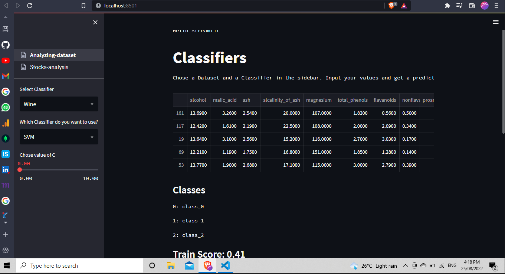

# app using Streamlit and LSTM
I tried my hands on LSTM
build interactive dashboards in Tableau with IcIcle Chart and Sub Tree Chart 

## Required packages
 pip install -r requirements.txt
or
 pip install streamlit, seaborn, scikit-learn, matplotlib, yfinance

## Data Analysis on different Dataset

Here, We will use 3 different models (KNN, SVM, Random Forest) for classification and give the user the ability to set some parameters. Before we get started import streamlit, the datasets from sklearn, various models from sklearn, libraries needed to make our plots and pandas

- Creating multipages in streamlit
  * Create main script named Stocks-analysis.py.
  * In same directory, create a new folder named pages
  * Add new .py files in the pages folder.
  * Add numbers before filename like, 01_Analyzing-Dataset.py  to arrange multipages.

-Evaluated possible permutations for maximizing returns and reducing risk with LSTM market model to increase profit by up to 5% 
from the short trades daily
  * Trained model using a Multilayer Neural Network to accurately F1 score up to 56 % for assigning labels for classification groups and 
     glimpses of pre-opening market predictions

 **References**
- https://www.youtube.com/watch?v=Klqn--Mu2pE&t=2291s
- https://luigibruno.medium.com/how-to-easily-build-a-stock-search-web-app-in-python-fada010e5fe

